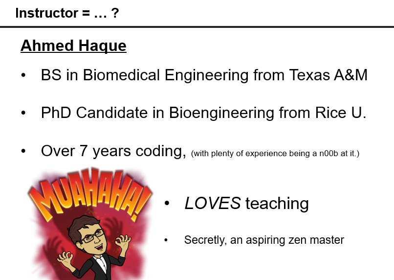
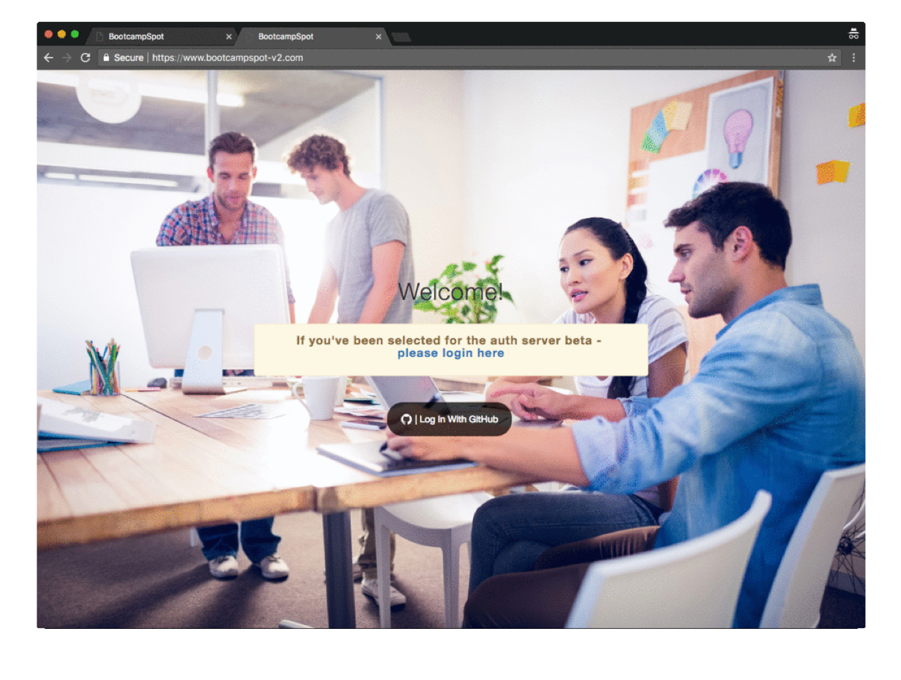
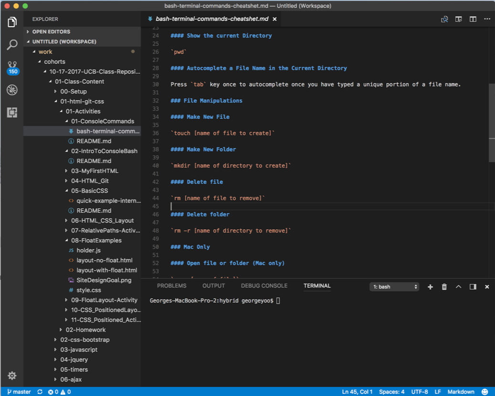
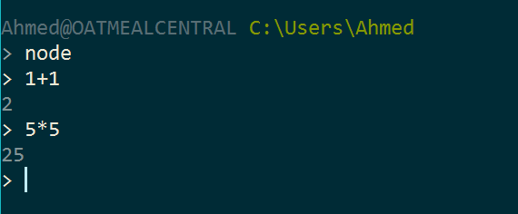
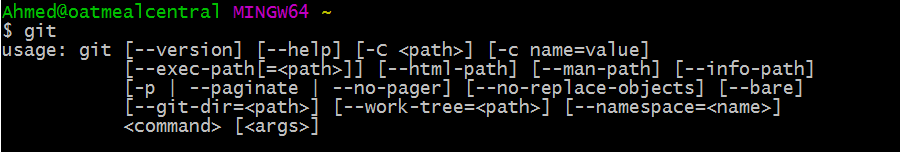
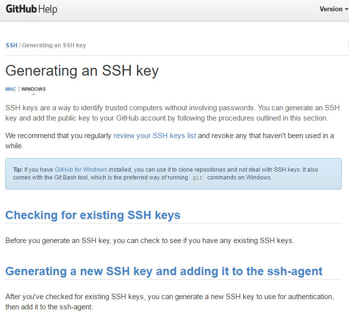
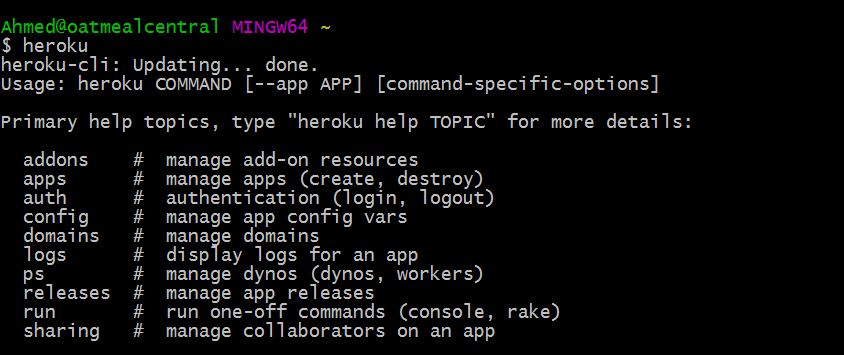

## 0.1 - Welcome and Installation (10:00 AM)

### Overview

Welcome to your first day of class! In this class, we will be introducing ourselves and the overall structure of the course.

`Summary: Complete Activity 1 in Unit 00`

##### Instructor Priorities

* Students should feel completely welcome and start to open up.
* Students should have each of the following installed and ready to use: Zoom, Git, Heroku, Node, Visual Studio Code, and Slack.
* Students should have their pre-work completed or are in the process of finishing it up.

##### Instructor Notes

* First off, welcome and thank you so much for being a part of our program! Thanks to instructors/TAs like yourself, we're helping hundreds of students across the world achieve their career goals and their creative dreams. You have plenty of time to work with these students, and their progress will astound you. Buckle in! You're in for a fun ride!

* Use the [Setup PowerPoint](Slide-Shows/) provided as an initial guide for today's class. During the first few weeks of class, we'll be using PowerPoints more extensively to give students a sense of structure. As we move further into the course, PowerPoints will become less frequently used as we dive into a more code-centric approach. Feel free to modify the slides to your own style, but be sure to cover the same activities.

* Don't forget to modify the PowerPoint prior to class to add in your own slides for the "Instructor Bio" and "Stuff You Made" sections.

* In addition to introductions, today's main focus is in making sure all students have all their pre-work (software / tools prerequisites) installed and ready to go. Many of your students will be coming to class with "partially" installed tools but will have gotten lost along the installation process. By the end of class, make sure EVERY one of your students has Git (with SSH Authentication), Heroku, Node, Visual Studio Code, and Slack, and Zoom installed. NOTE: You may need to run through this lesson plan to confirm you have all the necessary tools installed yourself!

* Have your TAs reference [01-Day-TimeTracker](01-Day-TimeTracker.xlsx) to help keep track of time during class.

- - -

### Class Objectives

* To allow students time to introduce themselves to one another and the instructional team
* To confirm that students have completed all required pre-work (software + tools installation)
- - -

### 1. Instructor Do: Begin Powerpoint + Zoom Mute/Unmute (5 min)

* Walk the students through the slides showing where they can find User Controls on Zoom, how one can mute/unmute themselves, and how to raise their hand virtually if they have any questions:

* User Controls
* Be sure that students are always muted unless called on and that their cameras are on! We want to see their faces!

* Raise hand
* Student's must always use the raise hand function to ask questions! This keeps it so that students don't interrupt each other in order to ask questions or interrupt lecture. Remind them to remember to unmute if they are called on!

* Tell students about the two physical locations that students can go to for class, study groups, or to work on projects with their peers!

* Pass it over to the SSM!

### 2. University Do: Introductions (30 mins)

* The next 35 minutes of class will consist of introductions by the university, program director, student services director, and/or career director.

* Instructor/TAs just hang tight and calm your nerves!

### 3. Instructor Do: Powerpoint + Introductions (15 mins)

* Open the Slide-Show `Setup` for your campus. Use it as a guide for the remaining sections, but keeping a close eye on your TAs to make sure you are keeping track of time. Be concise when you can!

* Have every student in the class introduce themselves (name, background, reason they joined). Try to keep things lighthearted as they share their ideas, but remember to try and keep things brief. We have a lot to go over in class today, and we'll need all the time we can get.

* Have TAs introduce themselves and provide their own backgrounds.

* Then introduce yourself and showcase one thing you've built (added into the slide).

* Briefly go over the class schedule and ask if there any questions regarding it.

### 4. Instructor Do: Powerpoint "Tools for Fools" (40 min)

* There are a lot of gifs in the following slides. Feel free to skip over them as this powerpoint will be given to students via their student repo for reference.

* Go over the slides covering the four main tools they'll be using: bootcampspot, Slack, Zoom, and Visual Studio Code.

* **Bootcampspot**

* Review logging in with Github

* Make sure to mark attendance!

* This is where all of your homework will be submitted. Feel free to leave comments with your submissions.

* **Slack**

* Make sure everyone installs the Slack Desktop Client.
* Link provided on slide

* Review each channel's purpose and how we'll use each one.
* #01-zoom-rooms: This is their North Star. If students (or staff) ever need to find the the class zoom rooms or if zoom room URLs ever change, this is the place to go!
* #02-class-activities: All activity, solution, and demo files will be slacked out here.
* #03-tech-support: If students have any questions about tech related items (zoom, slack, BCS, installations), this is where those questions go.
* #04-career-services: Periodically, the career services director will communicate important deadlines and other information in this channel.
* #05-ask-the-class: Any questions related to class content goes here. This is a great opportunity for students to help out other students! Remember, teaching is one of the best ways to learn!
* #06-shout-outs: If someone does something worthy of praise, post it here! We want to hear about it and cheer along.
* #general: Announcements, additional resources, and other general items will be posted here.
* #random: We all love gifs and hearing about the latest in marmot wrangling. Express your interests (and dislikes) here!

* Emphasize their real name and picture - one where you can see their face.

* **Zoom**

* Review required equipment. They have a few days to get these materials before next class.

* Have students setup personal free accounts on Zoom.us
* Link provided in slide

* Note that with a free zoom account, students can use their personal IDs to meet with classmates outside of class up to 40 minutes at a time!

* Have students download Zoom if they have not yet done so!

* Zoom Settings
* Make sure that everyone is logged into their new zoom accounts
* Video Tab: Check "Always display participants name on their video". This setting just makes sure that everyone's names are displayed on their video so you don't have to solely rely on the participants tab.
* General Tab: Check "Use Dual Monitors" and un-check "Full screen auto upon entering meeting". Enabling dual monitors is required because screen real estate becomes an issue with all of the tools we'll be using in this class!
* Accessibility: Check "Always show meeting controls". We want to make sure that everyone has meeting controls visible so they don't struggle to find essential features like muting/unmuting/share screen/etc.

* After going through every setting, have students restart zoom! This is so that all changes to the settings apply.

* Go through **features** and have students practice:

* **Gallery vs Speaker view**
* The Gallery/Speaker view toggle button is located at the top right corner. Take a few seconds for students to find it and try it themselves!

* **Screen share (Instructor)**
* Let the students know that what they are seeing is in fact the instructor sharing their screen! You'll be flipping between slideshows, a code editor, and a browser throughout class.
* Because student will likely want to ensure that they can see the instructor's shared screen clearly, let them know that they can drag the participants tab (the panel with the entire class' faces) over to their other monitor!

* **Screen share (Students)**
* Make sure that multiple screen share is enabled and have students share their screens! Flip through each student's shared screen and also warn them to be very cautious about sharing sensitive information while sharing their whole desktop.

* **Breakout rooms**
* Let students know that when you open breakout rooms, a prompt will appear in the middle of their Zoom window. If that window ever disappears or if they accidentally cancel, they can always find the "Breakout Room" icon in the User Controls panel.
* Open all breakout rooms and bring them all back to the main room!
* Note that when you close breakout rooms, they will have 60 seconds before everyone is forced back into the main room.

* **Polls!**
* Poll the class on how they are feeling about diving into a coding boot camp! Are they excited? Super excited? Meh? Just alright?

* **Visual Studio Code**

* Make sure all students have Visual Studio Code installed!

* Since Day 0 is in-person, have students keep in mind the following suggested screen set up:

* We’ll now be going over a suggested way to set up student screens so that they can maximize screen real estate! Keep in mind that this is just a suggestion! Students should ultimately do what works best for them.
- - -
### 5. BREAK/LUNCH (45 mins)
- - -

* There may be some students who decide to stay behind during break to troubleshoot problems that they had with the above material or to ask questions about the course. Try to assist those who are in need of help first so as to help them catch up with those students who did not face any issues. Feel free to use their breakout rooms or the tech support zoom room.

### 6. Instructor Do: Pre-Work (5 mins)

* Then walk through the slides on "Pre-work." Let students know that they should have all of the tools, the software applications, and the accounts shown on their machines but that if they ran into any snags, we will work with them to confirm everything is set up over the next 30 minutes.

### 7. Instructor Do: Confirm Pre-Work Installed (30 mins)

* TAs get ready to troubleshoot!

* Instructor: Walk through each of the following "test" processes to confirm whether students have successfully installed the right software. Have them follow along with you in class, and have them message a TA on Slack if they are missing something.

* **Terminal / Bash:**

* For Mac users. Have them open their Launcher and search for `Terminal`.

* For Windows users. Have them open the program called `Git Bash`.

* **Node:**

* While in terminal or bash, simply write the word `node`, and then hit enter. Your cursor should change

* Then type `1+1`, and hit enter. If node is installed it should translate the answer to 2.

* Then type `ctrl+c` to exit node.

* **GitHub:**

* Confirm that students all have an account on GitHub through a show of hands.

* Those that do not have an account should immediately create one.

* **Git:**

* Now we're getting to the harder stuff.

* While still in terminal or bash, type `git`, and hit enter. If Git is installed it should trigger a series of lines about Git.

* Now, to confirm that students have their GitHub accounts tied to their local Git using SSH authentication, have them type the following: `ssh -T git@github.com`. It should then ask for a passphrase (tied to your local account). Provide it (letters will not appear), and hit enter. If you are authenticated, it should provide a welcome message.

* Ask, via a show of hands, how many students did / did not get the welcome message (be expecting a lot of students who did not). If it seems that many students are missing this step, point them to the following link: [Generating an SSH Key - GitHub](https://help.github.com/articles/generating-an-ssh-key/).

* Walk around and help students as necessary, but keep track of time!

* **Heroku:**

* Once Git is covered ask how many students were able to create an account on Heroku. Show them your own Heroku account online as an example.

* Then have them once again go into Bash / Terminal and type the word `heroku`. If they are properly setup, it should provide a set of information about Heroku.

* **All others:**

* There are a few other items on the pre-work like MySQL, Stack Overflow, and Twitter that are less critical at this juncture. You may want to show that you have SQL Work Bench or Sequel Pro installed, but it's not critical just yet.

### 8. Groups Do: Pre-work Activities (45 mins)

* Just a note, this last portion of Day 0 is not as important as the above sections. If there is only 15 or so minutes remaining in class, it is advised that you end class and let students go early as the time it will take to split students into groups will likely leave students just a few minutes to go through the pre-work activities.

* Now that the pre-work installation check is finished, we'll be placing students into breakout room groups for the pre-work.

* Slack out <https://www.gitbook.com/read/book/the-coding-bootcamp/pre-work-book?key=CodingRocksAJ16> for any students looking for the URL to the pre-work.

* Create groups (3-4 students per group) based on how far along students are in the pre-work activities. Go down the list below, asking students to use the raise hand function in zoom. After you placed all students with their hands raised into groups, lower all hands, and continue this process. After all students have been assigned to breakout rooms, open rooms!

* **"I finished prework!"?**
* Have students take turns briefly sharing their activities to one another and discussing what they found to be interesting or challenging.

* **"I finished Module 5!"**
* Have students work together to finish the remaining modules.

* **"I started!"**
* These students are likely just starting off. Allow them some quiet time to get through the readings in modules 1-4.

* **"I swear I meant to…"**
* Group remaining students. They will be working together to complete as much of the pre-work as they can. Make sure that the instructional team is focusing more on lending a hand to the latter 2 groups.

### 9. Instructor Do: Wrap Up (5 mins)

* Ask for any final questions, go back over what they've covered today: their computer setup, and learning how to work remotely with others.

### 10. End (0 mins)

- - -

### Copyright

Coding Boot Camp © 2017. All Rights Reserved.

### Lesson Plan Feedback

How did today's class go?

[Went Well](http://www.surveygizmo.com/s3/4325914/FS-Curriculum-Feedback?format=lo&sentiment=positive&lesson=00.01)

[Went Poorly](http://www.surveygizmo.com/s3/4325914/FS-Curriculum-Feedback?format=lo&sentiment=negative&lesson=00.01)
